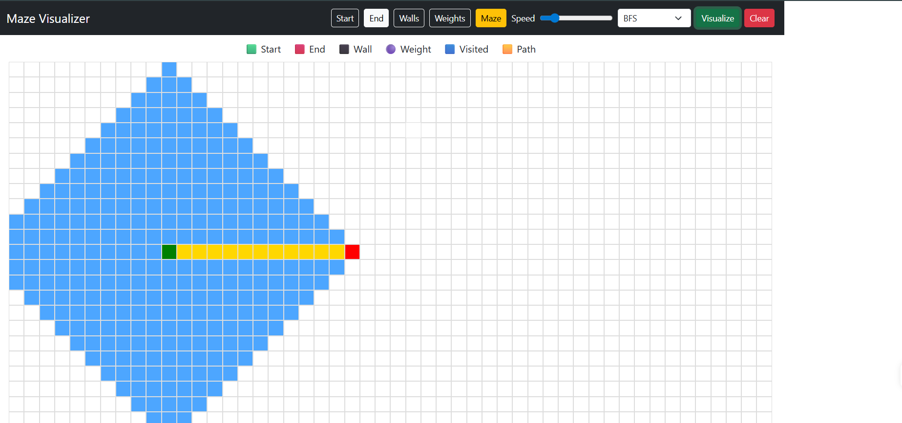
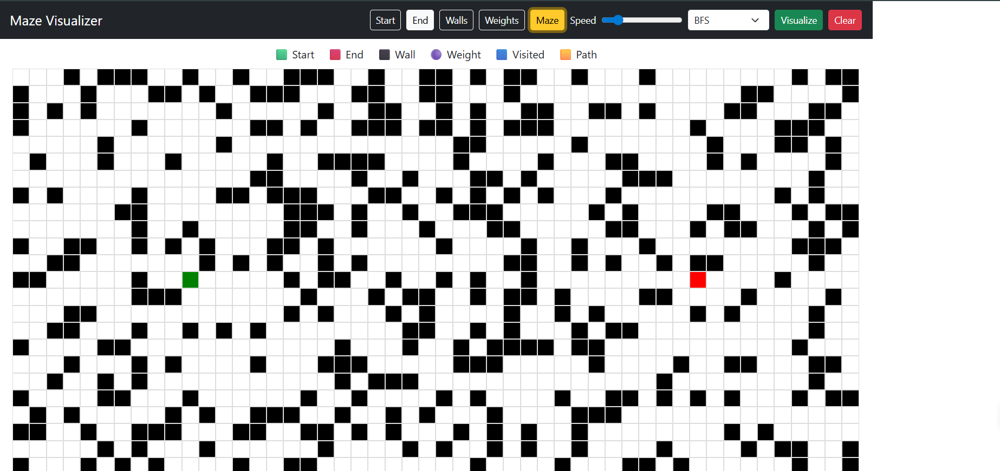
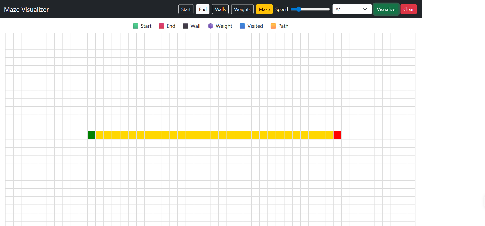

# Pathfinding Visualizer

An interactive web application to visualize popular pathfinding algorithms on a grid.
Users can create walls, add weighted nodes, generate mazes, and watch algorithms find the shortest path step-by-step.

🔗 **Live Demo:**
pathfinding-visualizer-lime.vercel.app

---

## Features

* Visualize **Breadth First Search (BFS)**
* Visualize **Dijkstra's Algorithm**
* Visualize **A* (A-Star) Algorithm**
* Draw **walls** to block paths
* Add **weighted nodes**
* **Maze generator**
* Adjustable **animation speed**
* Interactive **start and end nodes**

---

## Algorithms Implemented

### Breadth First Search (BFS)

Explores nodes level by level and guarantees the shortest path in an unweighted graph.

### Dijkstra's Algorithm

Finds the shortest path considering weights on nodes.

### A* Search Algorithm

Uses a heuristic (Manhattan distance) to efficiently find the shortest path toward the goal.

---

## Project Screenshots

### BFS Visualization



### Maze Generation



### A* Shortest Path



---

## Tech Stack

* React
* TypeScript
* Vite
* Bootstrap
* Vercel (Deployment)

---

## Run Locally

Clone the repository:

```
git clone https://github.com/Vindhya2006/pathfinding-visualizer.git
```

Go into the project folder:

```
cd pathfinding-visualizer
```

Install dependencies:

```
npm install
```

Run the development server:

```
npm run dev
```

---

## Future Improvements

* Add more algorithms (DFS, Greedy Best First Search)
* Add diagonal movement
* Improve maze generation algorithms
* Add mobile responsiveness

---

## Author

**Vindhya Choudhary**

BTech Student | Aspiring Machine Learning Engineer

GitHub:
https://github.com/Vindhya2006

